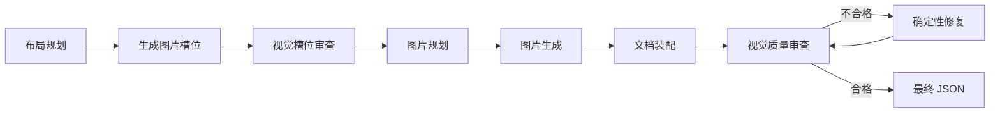

# 槽位驱动的 Agent 视觉设计方案

## 目标

解决当前设计 Agent 输出缺乏视觉层级、图片撑破布局、生成分辨率与画布尺寸混用的问题。改造后由布局节点先定义图片槽位，图片规划和图片生成只能消费槽位，最终结果必须经过视觉质量审查。

## 当前问题

- `image_planning` 将生图请求的宽高直接编译为元素 `fixedHeight`。
- `layout_planning` 只输出粗粒度策略和 section ID，无法表达主视觉、文字、CTA 的空间关系。
- 图片规划可以向普通容器追加大图，导致内容顺序和页面节奏不可控。
- 最终输出只验证 schema，不验证图片溢出、视觉层级、留白、对比度和首屏完整性。

## 节点流转



最多执行两轮视觉修复。达到上限后输出评分最高的有效版本，并将未解决问题写入 assumptions 和最终 artifact。

## 职责边界

### layout_planning

输入：确认后的五维意图、当前 DesignDocument、可用物料能力。

输出：

- 页面构图策略：`hero_split`、`editorial_sections`、`product_showcase`、`dashboard_grid`。
- 内容层级：主标题、核心卖点、主视觉、辅助信息、行动区。
- 区块节奏：`compact`、`standard`、`immersive`。
- section 内容密度上限。
- 完整 `imageSlots`。

该节点决定图片放在哪里以及如何显示，但不生成图片提示词。

### visual_slot_review

输入：layout plan、image slots、当前文档。

输出：槽位验证结果和确定性修复后的 layout plan。

检查槽位父级、角色、宽高比、高度范围、顺序、同一区块图片密度和首屏构图完整性。该节点不调用生图模型。

### image_planning

输入：已验证的 image slots、页面意图、相邻内容文本和视觉主题。

输出：每个槽位的图片语义、准确提示词和生成参数。

该节点只能引用已有 `slotId`，不能新增布局槽位、改变父级或修改显示尺寸。

### image_generation

输入：图片生成计划。

输出：图片 URL、provider、model、实际生成尺寸、失败信息。

生成宽高仅控制模型输出质量，不得写入 UI 元素布局高度。

### visual_review

输入：装配后的 DesignDocument、layout plan、image slots、生成结果。

输出：质量评分、问题列表和可执行修复动作。

该节点组合确定性验证与 LLM Reflection。确定性错误优先，LLM 负责视觉层级、节奏、相关性和风格一致性评价。

## Schema

```ts
type ImageSlot = {
  id: string;
  parentId: string;
  role: "hero" | "section" | "card" | "gallery";
  placement: "background" | "inline";
  display: {
    aspectRatio: "16:9" | "4:3" | "3:2" | "1:1" | "3:4";
    width: "fill" | "half" | "third";
    minHeight?: number;
    maxHeight: number;
    objectFit: "cover" | "contain";
    focalPoint: "center" | "top" | "left" | "right";
  };
  generation: {
    width: number;
    height: number;
    safeArea: "left" | "right" | "center" | "none";
  };
};
```

角色高度边界：

| 角色 | 最小高度 | 最大高度 |
| --- | ---: | ---: |
| hero | 360px | 560px |
| section | 240px | 420px |
| card | 160px | 280px |
| gallery | 180px | 360px |

同一 section 默认最多一张主图。需要图片组时必须显式使用 `gallery` 构图。

最终 DesignDocument 图片元素保留 `imageSlotId`。`requestedWidth` 和 `requestedHeight` 只作为生成元数据保留，不参与渲染尺寸计算。

## 节点通信与 Artifact

每个节点继续通过 blackboard artifact store 通信，不直接依赖上游节点内存对象：

- `layout_planning.vN.json`：构图、层级、节奏、槽位。
- `visual_slot_review.vN.json`：验证问题和修复后的槽位。
- `image_planning.vN.json`：槽位到生成请求的映射。
- `image_generation.vN.json`：生成结果和 provider 元数据。
- `document_assembly.vN.json`：装配后的完整文档。
- `visual_review.vN.json`：评分、问题和修复动作。
- `visual_repair.vN.json`：修复前后差异和修复计数。
- `final_output.vN.json`：最终文档及质量摘要。

状态新增 `visualRepairCount`、`bestVisualScore`、`bestDocumentRef`。恢复执行时从最新 artifact 重建，节点失败后无需重跑生图之前的所有步骤。

## 视觉审查输出

```ts
type VisualReview = {
  score: number;
  passed: boolean;
  issues: Array<{
    code: string;
    elementId?: string;
    severity: "low" | "medium" | "high";
    suggestion: string;
  }>;
  repairActions: Array<{
    kind: "resize_slot" | "change_fit" | "change_focal_point" | "reorder" | "reduce_density" | "adjust_contrast";
    targetId: string;
    value: unknown;
  }>;
};
```

确定性检查包括：

- 图片是否超过槽位和角色高度上限。
- 图片宽高比与槽位误差是否小于 2%。
- 首屏是否包含标题、主视觉和主操作。
- 是否连续堆叠多张全宽图片。
- 是否出现异常长空白区域。
- 前景文字与背景图的对比度是否满足可读性要求。

LLM Reflection 评价视觉层级、留白与节奏、图片相关性、风格一致性和页面完成度。

## 前端渲染

- 图片组件使用槽位 `aspect-ratio`、响应式宽度和 `max-height`。
- 不再使用 `generation.height` 或 `requestedHeight` 设置 `fixedHeight`。
- `cover` 图片将 `focalPoint` 转换为 `object-position`。
- `contain` 用于需要完整呈现的产品图，空余区域使用主题背景色。
- 背景图使用槽位最小高度和 safe area，文字区与主体焦点分离。
- 图片始终填充槽位，不改变父容器尺寸。

## 失败处理

- 槽位引用不存在：在 `visual_slot_review` 阶段失败并保存 artifact，不进入生图。
- 生图失败：保留槽位和失败元数据；必需图片按现有 provider 重试策略处理。
- 视觉审查失败：执行确定性 repair actions，不重新生成图片，除非问题明确为内容不相关或图片损坏。
- 两轮后仍低于 80 分：输出当前最高分有效文档，标记 `qualityGate: "degraded"` 并保存剩余 issues。
- schema 无效或元素树损坏：不得输出 final JSON。

## 测试与验收

### Schema 测试

- 禁止将生成尺寸编译为 UI `fixedHeight`。
- image planning 必须引用已验证的 slot ID。
- 槽位高度必须满足角色边界。
- 背景槽位只能绑定容器，inline 槽位只能生成图片元素。

### Agent 测试

- layout planning 先于 image planning 生成槽位。
- image planning 无法修改槽位布局。
- visual review 不通过时进入 repair，并最多循环两次。
- resume 能从最新 visual artifact 恢复评分和最佳文档。

### 浏览器测试

- 桌面和窄屏分别验证图片尺寸、裁切、溢出和首屏构图。
- 图片实际边界不得超过父容器。
- 图片显示宽高比与槽位误差小于 2%。
- 普通图片槽位不得超过 560px。
- 首屏必须有标题、主视觉和主操作。
- 连续全宽图片不超过一张。
- 页面控制台无运行时错误。

最终 JSON 的默认质量门槛为 `visual_review.score >= 80`。

## 迁移顺序

1. 扩展 layout schema 和 compiler，形成 image slots。
2. 新增 visual slot review，移除生成高度到 `fixedHeight` 的映射。
3. 修改 image planning，只消费槽位。
4. 调整前端图片渲染器和 DesignDocument 映射。
5. 新增 visual review 与最多两轮的 repair 路由。
6. 补齐 agent、resume、artifact 和浏览器测试。

该改造不改变五维意图识别、反问协议、WebSocket 对话协议和现有图片 provider 接口。
